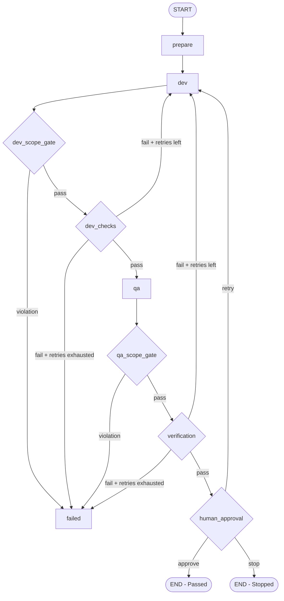

# LangGraph Software Factory — MVP Specification & Guidance Document

> **Purpose:** This document specifies **what** to build for a small software-factory proof of concept. It defines system requirements, architectural boundaries, data contracts, invariants, and acceptance criteria.  
>  
> **Developer Context:** The developer has extensive experience with **TypeScript and JavaScript**, but has **low familiarity with Python**. Provide TypeScript/JavaScript analogies and comparisons **only on demand when the developer asks for an explanation**, rather than for every constant thing.  
>  
> **Role of the AI Assistant (Guide & Mentor, Never Executor):**
> 1. **Do Not Execute:** The agent must **not** write implementation files or run development commands on behalf of the developer. The developer writes the code.
> 2. **Time-Boxed 1-Hour Steps:** Guide the developer through bite-sized steps designed for ~45–60 minute sessions.
> 3. **Propose Options & Paths First:** At each step, propose 2–3 viable implementation options with pros, cons, and trade-offs.
> 4. **Guide Upon Selection:** Once the developer selects a path, explain that specific path step-by-step and guide them through the implementation.
> 5. **Explain via TS/JS on Demand:** When the developer requests an explanation or clarification on Python syntax, types, or libraries, bridge it using clear TypeScript/JavaScript equivalents.
> 6. **Review & Verify:** Review human-written code against specifications, validate invariants, and confirm step success criteria before advancing.
>  
> **End Goal:** Construct an autonomous orchestration loop that can operate in two modes:
> - **Standalone:** Executed directly via CLI or standalone script.
> - **Externally Invocable:** Callable as an embedded sub-workflow or tool from outer agents such as **Antigravity** or **Codex**.

---

## 1. Goal

Build a local Python project where a story can be processed through the following multi-agent orchestration workflow:

```text
Story: docs/stories/crm-004/story.md
            |
            v
        DEV AGENT
   (Antigravity CLI first)
            |
            v
       DEV SCOPE GATE
            |
            v
     Deterministic checks
   lint / unit tests / build
            |
            v
          QA AGENT
   (Antigravity CLI first)
            |
            v
        QA SCOPE GATE
            |
            v
  verification/crm-004/*
            |
            v
     VERIFICATION GATE
        /          \
     PASS          FAIL
      |              |
      v              v
  HUMAN APPROVAL    DEV
      |              |
      v              +----> repeat (within limit)
     DONE
```

### Dual Operating Modes (End Goal):
1. **Standalone Execution:** The factory runs independently from the command line, providing real-time feedback and handling interactive human-in-the-loop approvals.
2. **External Agent Invocation:** The factory loop is packaged cleanly so outer agents (such as **Antigravity** or **Codex**) can invoke the factory as a discrete skill, tool, or subprocess, passing a story in and receiving structured execution results.

The first inner coding worker supported is the **Antigravity headless CLI (`agy`)**. The architecture must allow future adapters (such as Codex CLI or GLM/ZCode) to be added without altering the LangGraph workflow.

---

## 2. Core Invariants

These invariants are non-negotiable architectural rules. No agent or prompt may override them:

1. **Dev owns implementation code:** Dev has write permissions to application code and unit tests, but must never modify verification tests.
2. **QA owns verification tests:** QA writes independent tests under `verification/**` and must never modify application source code.
3. **Strict write isolation:** 
   - Dev changes touching `verification/**` must be rejected.
   - QA changes touching files outside `verification/**` must be rejected.
4. **Deterministic evaluation:** Gate decisions are made exclusively by deterministic tools (exit codes, test runners, git status), never by LLM self-evaluation or subjective declarations.
5. **No unverified claims:** A statement from QA claiming that "everything works" is never accepted. The factory must execute the verification tests independently.
6. **Structured failure feedback:** On verification or check failure, the factory generates a structured failure report and passes it back to Dev for the next attempt.
7. **Bounded retries:** The loop between failure and repair has a strict maximum attempt limit.
8. **Resumable human approvals:** A human approval gate can pause execution and persist state, allowing subsequent resumption.
9. **Provider neutrality:** LangGraph orchestrates roles, states, and gates; it must remain decoupled from provider-specific CLI syntax or internal tooling.
10. **Composability:** The core loop logic must be decoupled from the UI/CLI layer so it can be called programmatically by external tools or agents.

---

## 3. Orchestration Scope (Role of LangGraph)

LangGraph is responsible exclusively for the **outer workflow**, not the inner coding loop.

### LangGraph Responsibilities:
- Explicit state transitions and workflow routing.
- Feedback loops (e.g., `Verification Failure -> Dev Repair`).
- Deterministic conditional routing based on gate results and attempt counters.
- Durable persistence and checkpointer management.
- Human-in-the-loop pauses and resumptions via interrupts.
- Workflow observability and inspection through LangGraph Studio.

### Out of Scope for LangGraph:
- Replacing the internal reasoning or coding harness of Antigravity, Codex, or ZCode.
- Direct model prompting for coding tasks (the external CLI worker handles this).

---

## 4. Target Project Layout & Responsibilities

The project should be organized with clear separation of orchestration, workers, gates, stories, and artifacts:

```text
software-factory-poc/
├── docs/
│   ├── mvp_guide.md             # Specification, roadmap, and guidance
│   ├── prompt.md                # Session prompt template for the AI agent
│   └── stories/
│       └── crm-004/
│           └── story.md         # Story specification and acceptance criteria
├── src/                         # Application source code (Dev write scope)
├── tests/                       # Dev unit and integration tests (Dev write scope)
├── verification/                # Independent verification tests (QA write scope)
│   └── crm-004/
├── factory/                     # Orchestrator package
│   ├── __init__.py
│   ├── graph.py                 # LangGraph workflow definition and compilation
│   ├── state.py                 # Graph state schema definition
│   ├── gates.py                 # Deterministic check runners (lint, tests, verification)
│   ├── scope.py                 # Git-based scope enforcement
│   ├── prompts.py               # Prompt templates for Dev and QA roles
│   ├── runner.py                # Core programmatic loop (callable by CLI or Antigravity/Codex)
│   ├── cli.py                   # Terminal CLI entrypoint
│   └── workers/
│       ├── __init__.py
│       ├── base.py              # Abstract worker interface and response contracts
│       └── antigravity.py       # Antigravity headless CLI adapter
├── .factory/
│   └── runs/                    # Per-run execution artifacts and logs (git-ignored)
├── langgraph.json               # LangGraph Studio configuration
├── pyproject.toml               # Project metadata and dependencies
└── README.md
```

---

## 5. Environment & Dependencies Specification

### Requirements:
- **Runtime:** Python 3.11 or newer.
- **Package Manager:** Modern Python packaging (e.g., `uv` or `pip`). *(Analogous to `pnpm` / `npm` in TS/JS).*
- **Orchestration Libraries:**
  - `langgraph` (v1.2+): Graph definition, conditional edges, state handling, interrupts.
  - `langgraph-checkpoint-sqlite`: Durable state persistence across process runs.
- **Development & Tooling:**
  - `langgraph-cli`: Local dev server and LangGraph Studio integration.
  - Test runner (e.g., `pytest`): Running developer tests and QA verification tests. *(Analogous to `vitest` / `jest`).*
  - Linter/Formatter (e.g., `ruff`): Deterministic code quality gates. *(Analogous to `eslint` / `biome` / `prettier`).*

---

## 6. Story Specification & Contract

Every story must be defined in a structured document passed to both Dev and QA roles.

### Required Story Information:
- **Story Identifier:** Unique identifier (e.g., `crm-004`).
- **Goal Statement:** High-level description of what the user needs.
- **Acceptance Criteria:** Unambiguous, bulleted conditions required for completion.
- **Constraints:** Technical or behavioral limitations (e.g., backward compatibility, performance, scope limitations).

---

## 7. State Model Specification

The LangGraph state must be fully serializable to support checkpointers and process restarts. Live process handles or unpicklable objects must never be placed in the state.

### Required State Fields:
- **Story Metadata:**
  - `story_id`: String identifier of the story.
  - `story_path`: Filesystem path to the story specification.
  - `repo_root`: Root path of the target codebase.
- **Iteration Tracking:**
  - `attempt`: Current attempt index (1-based integer).
  - `max_attempts`: Maximum permitted retry attempts.
- **Worker Session Context:**
  - `dev_conversation_id`: Session/conversation identifier for the Dev worker (enables conversation reuse during repairs).
  - `qa_conversation_id`: Session/conversation identifier for the QA worker.
- **Gate Evaluation Results:**
  - `dev_status`: Exit status of Dev agent run.
  - `dev_scope_ok`: Boolean indicating whether Dev adhered to allowed write paths.
  - `dev_gate_ok`: Boolean indicating whether lint/unit tests passed.
  - `qa_status`: Exit status of QA agent run.
  - `qa_scope_ok`: Boolean indicating whether QA adhered to verification write paths.
  - `verification_ok`: Boolean indicating whether verification tests passed.
- **Diagnostic Artifacts:**
  - `failure_report`: Structured dictionary summarizing failures (test failures, errors, diffs). *(Analogous to a JS/TS error object / JSON payload).*
  - `changed_files`: List of files modified during the latest agent execution.
- **Overall Lifecycle Status:**
  - Discrete union of string literals: `"pending" | "running" | "waiting_human" | "passed" | "failed" | "stopped"`.

*Note:* Large command outputs and logs must be persisted as files in the run artifact directory; state should store file references rather than bloated text blobs.

---

## 8. Worker Abstraction Specification

The orchestration graph must interact with coding agents exclusively through a provider-agnostic interface. *(In TypeScript terms, this is an `interface` or abstract contract that concrete worker classes implement).*

### Abstract Worker Requirements:
- **Execution Input Contract:**
  - `prompt`: The formatted instruction set for the agent.
  - `cwd`: The target workspace root directory.
  - `conversation_id`: (Optional) Existing session identifier to resume a previous session for repairs.
- **Execution Output Contract:**
  - `status`: Execution outcome status (e.g., success, error, timeout).
  - `response`: Textual summary or output from the agent.
  - `conversation_id`: Captured session identifier to support follow-up prompts.
  - `raw_output_path`: (Optional) Path to raw logs or process output artifacts.
- **Pluggability:**
  - Initial target: `AntigravityWorker` (wrapping `agy`).
  - Extensible to future targets: `CodexWorker`, `GlmWorker`.

---

## 9. Antigravity Worker Requirements

The Antigravity adapter executes the headless CLI without requiring custom model API code.

### Adapter Responsibilities:
- **Authentication:** Rely on pre-existing cached credentials from interactive CLI login; do not embed credentials in graph code.
- **Invocation:** Spawn the CLI as a subprocess in the workspace directory. *(Analogous to Node.js `child_process.spawnSync` or `execFile`).*
- **CLI Options:**
  - Headless execution with prompt argument.
  - Structured output format (e.g., JSON).
  - Sandbox enabled.
  - Conversation identifier passing when resuming context.
- **Output Handling:**
  - Parse structured output from the CLI process.
  - Extract status, response message, and conversation ID.
  - Capture standard error and return codes, raising descriptive runtime errors on process crashes.
- **Safety Policy:**
  - Do **not** pass flags that bypass permissions or safety checks (e.g., `--dangerously-skip-permissions`).

---

## 10. Dev and QA Role Prompts

Role boundaries must be explicitly communicated in agent prompts, although prompts are considered guidance rather than hard security boundaries.

### Dev Role Prompt Requirements:
- Identify as the implementation agent for the given story.
- Mandate reading the story specification and existing codebase before writing code.
- Instruct the agent to implement the feature and run developer-level checks.
- Explicitly state read-only access to `verification/**` (no writes allowed).
- Forbid claiming completion if tests or commands fail.
- When retrying, include the structured deterministic failure report from the previous run.

### QA Role Prompt Requirements:
- Identify as the independent QA agent for the given story.
- Instruct the agent to read the story requirements and current implementation.
- Direct all test generation strictly into `verification/{story_id}/**`.
- Explicitly forbid modifying application source code.
- Explicitly forbid weakening acceptance criteria to match failing implementation code.
- Require producing executable, self-contained verification tests.

---

## 11. Scope Enforcement & Role Isolation

Enforce write boundaries using a multi-layer strategy.

### Layer A — OS / Provider Sandboxing (Where available):
- Restrict write access at the file-system or container level if supported by the provider.

### Layer B — Mandatory Git Scope Gate (Deterministic Invariant):
After each agent execution, inspect repository changes (e.g., via `git status` / `git diff --name-only`):
- **Dev Permitted Scope:**
  - Allowed: `src/**`, `tests/**`, project build/configuration files.
  - Forbidden: `verification/**`.
- **QA Permitted Scope:**
  - Allowed: `verification/{story_id}/**`.
  - Forbidden: All files outside `verification/**`.

### Scope Violation Actions:
- Mark the scope gate as failed.
- Generate and record a diff artifact of the forbidden modifications.
- Revert or discard forbidden file changes immediately.
- Prevent the workflow from proceeding down the normal success path.

---

## 12. Deterministic Gates Specification

All gates must be evaluated using real subprocess execution results.

### Gates to Implement:
1. **Dev Gate:**
   - Runs deterministic quality checks (linting, type checking, unit tests).
   - Collects exit codes, standard output, and standard error.
2. **Verification Gate:**
   - Executes independent verification tests located in `verification/{story_id}/**`.
   - Collects test execution outcomes and exit codes.

### Gate Evaluation Rules:
- Gate success is defined strictly as `exit_code == 0`.
- An LLM's explanation or opinion must never be used to evaluate a gate.

---

## 13. Failure Artifacts & Feedback Contract

A dedicated artifact directory must be maintained for each story run to ensure traceability and provide clean feedback.

### Directory Structure:
```text
.factory/runs/{story_id}/{run_id}/
├── story.md
├── dev/
│   ├── result.json              # Agent execution summary
│   └── diff.patch               # Changes produced by Dev
├── dev-gate.json                # Dev checks output and exit status
├── qa/
│   ├── result.json              # QA execution summary
│   └── diff.patch               # Tests produced by QA
├── verification-gate.json       # Verification test output and exit status
└── summary.json                 # End-to-end execution summary
```

### Feedback Package for Dev Repairs:
When a gate fails, pass a targeted context package back to Dev:
- The original story specification.
- A concise machine-generated failure summary (gate name, exit code, failing test names, relevant error log snippet).
- The existing Dev conversation ID to preserve conversational reasoning.

---

## 14. LangGraph Topology & Routing Specification

The workflow must be structured as a `StateGraph` with explicit nodes, linear transitions, and conditional branches.



### Node Responsibilities:
- `prepare`: Initialize run directory, thread ID, and initial state.
- `dev`: Invoke the Dev worker with current story and failure context.
- `dev_scope_gate`: Inspect git diff for Dev scope violations.
- `dev_checks`: Run deterministic lint and unit tests.
- `qa`: Invoke the QA worker to create verification tests.
- `qa_scope_gate`: Inspect git diff for QA scope violations.
- `verification`: Run the verification suite against the implementation.
- `human_approval`: Suspend execution via interrupt to prompt human decision.
- `failed`: Finalize run artifacts on unrecoverable failure.

---

## 15. Retry Policy & Limits

- Enforce a strict maximum attempt limit (default: 3 attempts).
- Each failed check or verification increases the attempt counter.
- If the attempt counter reaches the limit without passing, route directly to failure or human escalation.
- Retry limits cannot be altered dynamically by worker agents.

---

## 16. Human-in-the-Loop Gate Specification

- **Mechanism:** Use LangGraph interrupt capabilities (`interrupt()`) to halt the graph cleanly when verification passes.
- **Options Presented:**
  1. `approve`: Mark status as passed and terminate workflow successfully.
  2. `retry`: Route back to the Dev node for another refinement iteration.
  3. `stop`: Mark status as stopped and terminate workflow without further changes.
- **Resumption Contract:** The human decision is passed back using the graph resume command, continuing from the saved checkpoint with the same thread identifier.

---

## 17. Persistence & Checkpointing Requirements

- **Checkpointer:** Use SQLite checkpointing (`SqliteSaver`) rather than ephemeral in-memory storage.
- **Thread Management:** Every run must be assigned a deterministic, reproducible `thread_id` (e.g., `{story_id}-{timestamp}`).
- **Durability:** Checkpoints must persist state across process restarts, crashes, or terminal interruptions.

---

## 18. Studio Inspection Requirements

- Provide a `langgraph.json` configuration mapping the graph name to the compiled graph object.
- Support running `langgraph dev` so developers can visually inspect state changes, routing decisions, interrupt states, and execution histories in LangGraph Studio.

---

## 19. Invocation Contract: Standalone & External (Antigravity / Codex)

To satisfy the end goal of being callable both standalone and from external harnesses:

### 1. Programmatic Runner Interface (`factory.runner`):
- Expose a clean Python entrypoint function (e.g. `run_factory(...)`) that accepts:
  - `story_path`: Path to story markdown.
  - `thread_id`: Optional run identifier (or auto-generated).
  - `checkpoint_db`: Path to persistence database.
  - `resume_decision`: Optional interrupt resumption action (`approve`, `retry`, `stop`).
- Returns structured results (final state, status, run artifacts path).
- This interface allows **Antigravity** or **Codex** to trigger the factory loop as a tool, subagent, or embedded task.

### 2. Standalone CLI Interface (`factory.cli`):
- Built on top of the programmatic runner.
- Accepts commands like `python -m factory.cli run <story_id>` or `python -m factory.cli resume <thread_id> --decision approve`.
- Handles interactive terminal I/O (displaying progress banners, prompting for human decisions during interrupts).

---

## 20. Step-by-Step Implementation Roadmap (1-Hour Sessions)

The project is structured into self-contained **1-hour sessions (~45–60 minutes each)**. In each session, the AI assistant presents implementation options/paths, waits for the developer's choice, and guides them through the implementation with TypeScript/JavaScript comparisons.

---

### Step 1: Environment & Virtual Environment Setup (~1 hour)
- **Goal:** Initialize project workspace, configure Python virtual environment, install LangGraph dependencies, and verify setup.
- **TS/JS Analogy:** Initializing `package.json` (`pnpm init`) and installing packages into `node_modules`.
- **Options the Agent Proposes:**
  - *Option A (Modern & Fast):* Using `uv` for instant venv creation and dependency resolution.
  - *Option B (Standard Library):* Using standard Python `venv` + `pip`.
- **Step Success Criteria:**
  - [x] Virtual environment created and activated (managed via `uv` / `.venv`).
  - [x] Dependencies installed (`langgraph` v1.2.12, `langgraph-checkpoint-sqlite` v3.1.1, `pytest` v9.1.1, `ruff` v0.16.9).
  - [x] Verification command `importlib.metadata.version('langgraph')` succeeds.
- **Completed Implementation Summary:**
  - **Tool Selected:** Option A (`uv`).
  - **Artifacts Initialized:** `pyproject.toml`, `uv.lock`, and `.venv/`.
  - **Packages Added:** `langgraph`, `langgraph-checkpoint-sqlite`, `pytest`, `ruff`.
  - **Verification:** Successfully executed verification via `uv run python` confirming LangGraph v1.2.12 is active and all modules import cleanly.

---

### Step 2: Story Contract & State Schema Definition (~1 hour)
- **Goal:** Create the initial story file (`docs/stories/todo-app/story.md`) and define the state schema in `factory/state.py`.
- **TS/JS Analogy:** Defining a TypeScript interface (`interface FactoryState { ... }`) and a Markdown input document.
- **Options the Agent Proposes:**
  - *Option A (Standard & Lightweight):* Python `typing.TypedDict` (exact counterpart of a TS `type` or `interface`).
  - *Option B (Runtime Validated):* Pydantic `BaseModel` (counterpart of TS runtime validation libraries like Zod).
- **Step Success Criteria:**
  - [x] Story file created with acceptance criteria and constraints.
  - [x] `factory/state.py` defines all required state fields with proper type annotations.
  - [x] Schema imports without syntax or typing errors.
- **Completed Implementation Summary:**
  - **Tool & Approach Selected:** Option A (`typing.TypedDict` and `typing.Literal`).
  - **Artifacts Created:**
    - [docs/stories/todo-app/story.md](file:///d:/2grow/lang-factory/docs/stories/todo-app/story.md): Client-side React Todo app with `localStorage` persistence, deterministic test IDs, and explicit QA verification scope.
    - [.gitignore](file:///d:/2grow/lang-factory/.gitignore): Project-wide ignores for Python, virtual environments, factory artifacts, and Node/React dependencies.
    - [.vscode/settings.json](file:///d:/2grow/lang-factory/.vscode/settings.json): IDE configuration for `onFocusChange` auto-saving and automatic formatting on save.
    - [factory/state.py](file:///d:/2grow/lang-factory/factory/state.py): `FactoryState` schema tracking story metadata, attempts, conversation sessions, gate results, diffs, and lifecycle states.
  - **Verification:** Successfully validated `from factory.state import FactoryState` using `uv run python`.

---

### Step 3: Mock Graph Topology & Studio Inspection (~1 hour)
- **Goal:** Create `factory/graph.py` with mock node functions that return dummy state, configure `langgraph.json`, and visualize in Studio.
- **TS/JS Analogy:** Building an XState or Redux state machine with stub action handlers to verify state transitions visually.
- **Options the Agent Proposes:**
  - *Option A (Declarative):* Using `builder.add_conditional_edges()` with a routing function.
  - *Option B (Explicit Navigation):* Using LangGraph `Command(goto=...)` inside node functions.
- **Step Success Criteria:**
  - [x] Graph compiles cleanly with all required nodes (`prepare`, `dev`, `qa`, etc.).
  - [x] Running `langgraph dev` renders the complete workflow visually in LangGraph Studio.
  - [x] A mock run transitions through nodes from START to END.
- **Completed Implementation Summary:**
  - **Approach Selected:** Option A (Declarative Routing with `add_conditional_edges` and router functions).
  - **Artifacts Created & Configured:**
    - [factory/graph.py](file:///d:/2grow/lang-factory/factory/graph.py): Complete workflow definition containing 9 mock nodes, router functions for conditional gating and retry loops, and compilation into `graph`.
    - [langgraph.json](file:///d:/2grow/lang-factory/langgraph.json): Configuration file exposing the `factory` graph to LangGraph Studio and CLI.
    - [pyproject.toml](file:///d:/2grow/lang-factory/pyproject.toml): Added `langgraph-cli[inmem]` dependency.
  - **Verification:**
    - Executed programmatic mock run via `uv run python`, successfully traversing all nodes from `START` to `END` and outputting `Final Status: passed`.
    - Launched `uv run langgraph dev` and verified the full interactive visual topology in LangGraph Studio.

---

### Step 4: Deterministic Gate Runner (~1 hour)
- **Goal:** Implement `factory/gates.py` to run subprocess commands (lint, unit tests), capture exit codes, and return structured gate outcomes.
- **TS/JS Analogy:** Writing a helper wrapping Node's `child_process.spawnSync` to execute shell commands and check `status === 0`.
- **Options the Agent Proposes:**
  - *Option A (Direct Subprocess):* Standard `subprocess.run(capture_output=True, text=True)`.
  - *Option B (Shell Runner Wrapper):* Configurable command runner class with timeout and output truncation guards.
- **Step Success Criteria:**
  - [x] `run_gate` function executes arbitrary commands and returns a structured `GateResult`.
  - [x] A passing command returns `ok=True, exit_code=0`.
  - [x] A failing command returns `ok=False, exit_code!=0` with captured `stderr`.
- **Completed Implementation Summary:**
  - **Approach Selected:** Option A (Direct Functional Runner with `subprocess.run`).
  - **Artifacts Created:**
    - [`factory/gates.py`](file:///d:/2grow/lang-factory/factory/gates.py): Universal deterministic gate runner exporting `GateResult` dataclass and `run_gate()` helper with `capture_output=True`, `text=True`, `shell=True`, timeout safeguards, and error/exception handling.
  - **Verification:** Successfully executed verification in terminal testing both passing (`git --version` -> `ok=True, exit_code=0`) and failing (`exit(42)` -> `ok=False, exit_code=42`) command scenarios.

---

### Step 5: Run Artifacts & Structured Failure Reports (~1 hour)
- **Goal:** Build the artifact manager to initialize `.factory/runs/{story_id}/{run_id}/` and save machine-readable failure reports.
- **TS/JS Analogy:** Writing a logging utility using `fs.promises.mkdir` and `fs.promises.writeFile` to persist run outputs.
- **Options the Agent Proposes:**
  - *Option A (Simple Module Functions):* Lightweight procedural functions using `pathlib.Path`.
  - *Option B (Artifact Manager Class):* Encapsulated manager class tracking active artifact paths and diff patches.
- **Step Success Criteria:**
  - [x] Calling the artifact initializer creates the run folder structure with timestamped ID.
  - [x] Failure reports write valid JSON containing `gate`, `exit_code`, `failed_tests`, and `stderr_tail`.
- **Completed Implementation Summary:**
  - **Approach Selected:** Option A (Functional Module using `pathlib.Path`).
  - **Artifacts Created:**
    - [`factory/artifacts.py`](file:///d:/2grow/lang-factory/factory/artifacts.py): Functions `init_run_dir()` for structured run tree setup (`.factory/runs/{story_id}/{run_id}/dev` & `qa`), `save_gate_result()` for raw gate JSON outputs, and `create_failure_report()` / `save_failure_report()` for machine-readable failure payloads with `stderr` tails.
  - **Verification:** Successfully executed verification command creating run folder `.factory/runs/todo-app/test-run-001/` and persisting both `dev-gate.json` and `dev-gate-failure.json`.

---

### Step 6: Worker Interface & Mock Worker (~1 hour)
- **Goal:** Define `factory/workers/base.py` with an abstract interface for coding workers and create a stub worker for testing.
- **TS/JS Analogy:** Defining a TypeScript interface `interface CodingWorker { run(args): WorkerResult }` and implementing a mock class.
- **Options the Agent Proposes:**
  - *Option A (Structural Subtyping):* Python `typing.Protocol` (duck typing identical to TypeScript interfaces).
  - *Option B (Nominal Inheritance):* `abc.ABC` with `@abstractmethod` (like classic Java / abstract TS classes).
- **Step Success Criteria:**
  - [ ] `CodingWorker` protocol and `WorkerResult` dataclass defined.
  - [ ] `MockWorker` satisfies the protocol and returns simulated diffs and status.
  - [ ] Dev and QA graph nodes successfully execute the mock worker.

---

### Step 7: Headless Antigravity Worker Adapter (~1 hour)
- **Goal:** Implement `factory/workers/antigravity.py` to invoke the headless `agy` CLI as a subprocess and parse JSON responses.
- **TS/JS Analogy:** Building a service wrapper in Node.js that spawns an external CLI, parses stdout JSON, and handles errors.
- **Options the Agent Proposes:**
  - *Option A (Synchronous JSON Execution):* Invoke `agy -p ... --output-format json` and parse completed output.
  - *Option B (Streaming Event Processing):* Stream JSON lines to capture live progress events.
- **Step Success Criteria:**
  - [ ] Adapter executes `agy` with workspace directory, sandbox enabled, and prompt.
  - [ ] Extracts `status`, `response`, and `conversation_id`.
  - [ ] Confirms cached user credentials work without interactive login prompts.

---

### Step 8: Git Scope Enforcement Gate (~1 hour)
- **Goal:** Implement `factory/scope.py` to check repository changes using `git diff --name-only` and enforce Dev/QA write boundaries.
- **TS/JS Analogy:** A pre-commit hook or file glob matcher (`minimatch`) validating touched files against an allowlist/denylist.
- **Options the Agent Proposes:**
  - *Option A (Pathlib Pattern Matching):* Path matching using Python's native `pathlib.Path.match`.
  - *Option B (Fnmatch Globbing):* Using `fnmatch.fnmatch` with Unix-style glob rules.
  - *Option C (Prefix & Rule Matching):* Deterministic directory prefix and role rule checker.
- **Step Success Criteria:**
  - [x] Modifying `verification/**` during a Dev run fails the Dev scope gate.
  - [x] Modifying files outside `verification/**` during a QA run fails the QA scope gate.
  - [x] Scope violations automatically generate a diff artifact and revert forbidden changes via git.
- **Completed Implementation Summary:**
  - **Approach Selected:** Option C (Prefix & Rule Matching with normalized POSIX paths).
  - **Artifacts Created:**
    - [`factory/scope.py`](file:///d:/2grow/lang-factory/factory/scope.py): Implemented `ScopeResult` dataclass, `get_changed_files()` using `git status --porcelain`, `get_git_diff()`, `check_scope()` enforcing Dev/QA boundaries, `revert_violations()` with `git restore` and `git clean`, and top-level `enforce_scope()`.
    - [`.vscode/settings.json`](file:///d:/2grow/lang-factory/.vscode/settings.json) & [`.vscode/extensions.json`](file:///d:/2grow/lang-factory/.vscode/extensions.json): Configured auto-save on window focus change, formatting on save, and Ruff extension recommendation.
  - **Verification:** Successfully executed verification test confirming Dev correctly flags `verification/test.py` violations and QA correctly flags `src/app.py` violations.

---

### Step 9: QA Role Integration & Verification Suite (~1 hour)
- **Goal:** Wire the QA node with specialized prompts to generate tests under `verification/{story_id}/**`, and configure the verification gate.
- **TS/JS Analogy:** Directing test generator output into a distinct integration test folder and running it with a test runner.
- **Options the Agent Proposes:**
  - *Option A (Pytest Subdirectory):* Run verification tests using `pytest verification/{story_id}`.
  - *Option B (Custom Test Runner Script):* Run verification tests through a dedicated gate script.
- **Step Success Criteria:**
  - [x] QA agent writes verification tests only under `verification/{story_id}/**`.
  - [x] Verification gate executes the tests independently and collects pass/fail results.
- **Completed Implementation Summary:**
  - **Approach Selected:** Option B (Dedicated Verification Gate Module in `factory/gates.py` + Role Prompt Builders).
  - **Artifacts Created & Updated:**
    - [`factory/gates.py`](file:///home/user/2grow/lang-factory/factory/gates.py): Added `run_verification_gate()` with test directory existence guard, verbose `pytest` execution on `verification/{story_id}`, and structured `GateResult` output.
    - [`factory/prompts.py`](file:///home/user/2grow/lang-factory/factory/prompts.py): Created `build_qa_prompt()` and `build_dev_prompt()` enforcing write boundaries, role isolation, and structured failure report attachment.
    - [`factory/graph.py`](file:///home/user/2grow/lang-factory/factory/graph.py): Wired `qa_scope_gate` to enforce QA write boundaries via `enforce_scope()` and wired `verification` node to run `run_verification_gate()`.
  - **Verification:** Executed verification gate with sample test in `verification/todo-app/test_sample.py` and confirmed `GateResult(ok=True, exit_code=0)` via pytest.

---

### Step 10: Feedback & Repair Loop with Bounded Retries (~1 hour)
- **Goal:** Wire verification failures back to Dev, passing structured failure reports and reusing `conversation_id`, enforcing attempt limits.
- **TS/JS Analogy:** A state-machine retry transition with a maximum retry counter (`while (attempts < maxAttempts)`).
- **Options the Agent Proposes:**
  - *Option A (Conditional Edge Routing):* Routing function checks `state['attempt'] < state['max_attempts']`.
  - *Option B (Explicit Command Goto):* Node returns `Command(goto='dev')` on retry or `Command(goto='failed')` when exhausted.
- **Step Success Criteria:**
  - [ ] A verification failure routes back to Dev with the structured failure report attached.
  - [ ] Dev prompt incorporates previous failure details and reuses the Antigravity conversation ID.
  - [ ] Exceeding max attempts (e.g., 3) routes directly to failure/escalation.

---

### Step 11: Human Approval Gate via LangGraph Interrupt (~1 hour)
- **Goal:** Add `human_approval` node using LangGraph `interrupt()`, halting execution on verification pass and resuming via command.
- **TS/JS Analogy:** Pausing an asynchronous workflow awaiting an external webhook, resolution event, or user prompt.
- **Options the Agent Proposes:**
  - *Option A (Simple Dict Interrupt):* Pass question and options array to `interrupt({...})`.
  - *Option B (Typed Command Interrupt):* Return typed `Command` with state status updates.
- **Step Success Criteria:**
  - [ ] Workflow halts automatically when verification passes.
  - [ ] Passing `"approve"` resumes to `END (Passed)`.
  - [ ] Passing `"retry"` resumes and routes back to `dev`.
  - [ ] Passing `"stop"` resumes to `END (Stopped)`.

---

### Step 12: Durable SQLite Persistence & Resumption (~1 hour)
- **Goal:** Connect `SqliteSaver` checkpointer, assign deterministic `thread_id`, and verify resumption across process restarts.
- **TS/JS Analogy:** Persisting workflow state checkpoints in SQLite so a crashed or restarted service resumes where it left off.
- **Options the Agent Proposes:**
  - *Option A (Dedicated DB File):* Storing checkpoints in `.factory/checkpoints.sqlite`.
  - *Option B (Per-Run Checkpoint DB):* Isolating checkpoint DB per story.
- **Step Success Criteria:**
  - [ ] Graph execution state persists to SQLite database.
  - [ ] Killing the Python process while waiting at the human gate does not lose state.
  - [ ] Resuming with the same `thread_id` continues the run seamlessly.

---

### Step 13: Programmatic Runner Interface (~1 hour)
- **Goal:** Decouple the runner from the CLI by creating `factory/runner.py` with `run_factory(...)` for external invocation.
- **TS/JS Analogy:** Exporting an SDK function from an npm package so other scripts and agents can import and run it.
- **Options the Agent Proposes:**
  - *Option A (Synchronous Runner Function):* Blocking function returning final state and artifact paths.
  - *Option B (Generator / Streaming Runner):* Yielding progress events as each node executes, with a final return value.
- **Step Success Criteria:**
  - [ ] A Python script or external agent can import `from factory.runner import run_factory`.
  - [ ] Calling `run_factory(...)` executes the loop headlessly and returns structured JSON results.

---

### Step 14: Terminal CLI & End-to-End Story Verification (~1 hour)
- **Goal:** Implement `factory/cli.py` to provide a friendly terminal UI and execute story `crm-004` end-to-end.
- **TS/JS Analogy:** Building a CLI entrypoint using `commander` / `yargs` to parse command-line arguments and format terminal logs.
- **Options the Agent Proposes:**
  - *Option A (Standard Library `argparse`):* Built-in, zero-dependency CLI parser.
  - *Option B (`click` or `typer`):* Feature-rich CLI library with automatic help menus and color formatting.
- **Step Success Criteria:**
  - [ ] Running `python -m factory.cli run crm-004` executes the full story workflow.
  - [ ] Banners display progress for Dev, Gates, QA, and Verification.
  - [ ] Interactive prompt appears for human decision and successfully completes the story.

---

## 21. Out of Scope for MVP

Do not implement these features in the initial proof of concept:
- Distributed queues or task schedulers (Redis, Celery).
- Container orchestration (Kubernetes, Docker Swarm).
- Web-based management dashboards.
- Autonomous supervisor LLMs with dynamic graph-rewriting powers.
- Automated production deployment pipelines.
- Multi-story concurrent batch execution.
- Custom low-level model harness implementations.

---

## 22. Optional Phase 2 — Supervisor LLM (Advisory Only)

In later phases, an LLM supervisor node may be added to provide recommendations (e.g., suggest switching providers, recommend specific test strategies), but it must **never** be given authority to override invariants, bypass scope gates, or alter deterministic check results.

---

## 23. Optional Phase 3 — Antigravity SDK Comparison

After the CLI-based factory is stable, an alternative `AntigravitySdkWorker` may be implemented behind the same worker interface to benchmark performance, cost, and reliability against the stock headless CLI.

---

## 24. MVP Acceptance Criteria Checklist

The proof of concept is complete when all of the following are demonstrated:

- [ ] Story execution can be started via a single CLI command or programmatic invocation.
- [ ] Dev runs through the Antigravity headless CLI (`agy`).
- [ ] Dev scope gate strictly rejects unauthorized modifications to `verification/**`.
- [ ] Dev deterministic checks (lint/unit tests) are executed and evaluated by the factory.
- [ ] QA runs as a distinct agent invocation.
- [ ] QA writes verification tests strictly under `verification/{story_id}/**`.
- [ ] QA scope gate strictly rejects unauthorized modifications to application code.
- [ ] Verification tests are executed independently by the factory gate runner.
- [ ] A verification failure automatically routes back to Dev with a structured failure report.
- [ ] Retry attempts are bounded by a fixed limit.
- [ ] Passing verification halts execution at a human approval interrupt.
- [ ] The workflow can be resumed after the human decision is entered.
- [ ] The graph and its execution history can be visualized in LangGraph Studio.
- [ ] Provider-specific logic is fully isolated behind the worker abstraction.
- [ ] The factory loop is decoupled so it can be called standalone or invoked directly from Antigravity / Codex.

---

## 25. Instructions for the AI Assistant (Interaction Rules)

When guiding the developer through this project, the AI assistant must adhere strictly to these operational rules:

### Rule 1: One Step at a Time (~1-Hour Scope)
- Focus exclusively on the current step from Section 20.
- Do not dump code or requirements for subsequent steps.
- Maintain a manageable pace suitable for a 45–60 minute session.

### Rule 2: Propose Options & Paths First
- At the start of each step, **do not prescribe a single solution**.
- Present 2 to 3 viable implementation paths (as outlined in Section 20).
- Explain the trade-offs (e.g., simplicity vs. extensibility, standard library vs. third-party package).
- **Wait for the developer to select their preferred path** before proceeding.

### Rule 3: Guide and Explain Step-by-Step, Never Execute
- **Do not write the files or execute commands.** The developer writes the code and executes commands.
- Break down the selected implementation path into small, actionable steps.
- Explain *why* each part is needed and *what* it accomplishes.

### Rule 4: Bridge Python Concepts Using TypeScript & JavaScript (On Demand)
- Provide TypeScript/JavaScript comparisons **only when the developer explicitly requests an explanation or clarification**, rather than proactively adding analogies for every concept:
  - *`TypedDict` / Pydantic* $\leftrightarrow$ *TypeScript `interface` / `type` / Zod*.
  - *`Protocol` (structural subtyping)* $\leftrightarrow$ *TypeScript `interface`*.
  - *`subprocess.run`* $\leftrightarrow$ *Node.js `child_process.spawnSync` / `execSync`*.
  - *`@dataclass`* $\leftrightarrow$ *TS class with public constructor properties*.
  - *Virtual environments (`uv` / `venv`)* $\leftrightarrow$ *`node_modules` and `package.json`*.
  - *`*args` and `**kwargs`* $\leftrightarrow$ *Rest parameters (`...args`) and object destructuring*.
  - *Decorators (`@node`)* $\leftrightarrow$ *TS/JS decorators or higher-order functions*.
  - *Exceptions vs Errors* $\leftrightarrow$ *`try/catch` and `Error` handling*.

### Rule 5: Design for Dual Invocation (Standalone & Antigravity/Codex)
- Remind and guide the developer to decouple the core loop from the CLI interface.
- Ensure the workflow can be imported and executed programmatically by an external agent (e.g. Antigravity subagent/skill or Codex execution harness) as well as run directly from the command line.

### Rule 6: Code Review & Invariant Enforcement
- When the developer shares code, review it against the core invariants:
  - Are Dev and QA write paths strictly segregated?
  - Are gates evaluated exclusively by command exit codes?
  - Is the graph state kept fully serializable?
  - Are retry counts strictly bounded?
- Point out potential bugs, edge cases, and deviations from specifications.

### Rule 7: Validate Success Criteria Before Advancing
- For each step, prompt the developer to test and verify their work.
- Ensure all step success criteria are confirmed before moving on to the next 1-hour session.
